# Harbinger Serverless Price Feed Signer

## About

`harbinger-signer` is a signer for the Harbinger oracle system. `harbinger-signer` is a [Serverless Framework](https://serverless.com/) application written in Typescript and deployed to [Amazon Web Services](https://aws.amazon.com). To get started with Harbinger, visit the [main documentation](https://github.com/tacoinfra/harbinger).

Cryptographic signatures are generated by [Amazon Key Management Service](https://aws.amazon.com/kms/), a highly service that uses hardware security modules (HSMs). The app is extensible to produce feeds from other APIs and to use other signing solutions besides Amazon KMS. See 'Customizing Functionality' below.

This library provides functionality for signing a Harbinger price feed. Users interested in posting prices might also be interested in [Harbinger CLI](https://github.com/tacoinfra/harbinger-cli) and [Harbinger Poster](https://github.com/tacoinfra/harbinger-poster) which provide both command line and Serverless methods of posting signed price data on-chain. Developers of new Harbinger components may be interested in [harbinger-lib](https://github.com/tacoinfra/harbinger-lib).

### Introduction

The Harbinger Tezos price oracle consists of two main components:
- A <em>**signer**</em> that retrieves price candles from an exchange and cryptographically signs them.
- A <em>**poster**</em> that retrieves the signed price feed from a signer and sends the signed data to a smart contract on the Tezos network.

This project is a reference price feed signer that demonstrates how to retrieve prices from multiple exchanges including Coinbase Pro, Binance, Gemini, and OKEx, and sign them with a private key that is securely stored inside [Amazon Key Management Service](https://aws.amazon.com/kms/). It is a [Serverless Framework](https://serverless.com) application. Once deployed, there is no need to spend any time thinking about or managing servers.

## Setup Instructions

In order to setup the Serverless application, you'll need to perform the following setup tasks first:
 1. [Install the AWS CLI](https://docs.aws.amazon.com/cli/latest/userguide/cli-chap-install.html) on your system.
 2. [Create an AWS access key](https://aws.amazon.com/premiumsupport/knowledge-center/create-access-key/) and configure the AWS CLI by running the `aws configure` command.
 3. Login to the AWS console with an account that has the ability to create KMS keys and SSM parameters, and grant permissions to use them. An admin role will work best.
 4. Be sure to select the correct region that you would like to deploy to. The [serverless.yml](serverless.yml) file in this repository is set to use the `eu-west-1` (Ireland) region, but you can easily edit this file and select a different region if you like. The important thing is to ensure that the region you select in the console is the same region that is specified in the Serverless configuration file.
 5. In the AWS console, select the KMS service:

 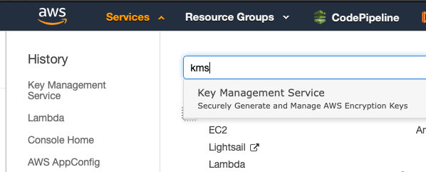

 6. Click the "Create key" button:

 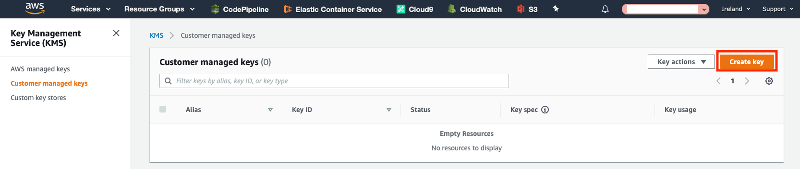

 7. Select <em>**Asymmetric**</em> under Key type, then select <em>**Sign and verify**</em> under Key usage, then select <em>**ECC_SECG_P256K1**</em> under Key spec, and click the <em>**Next**</em> button:

 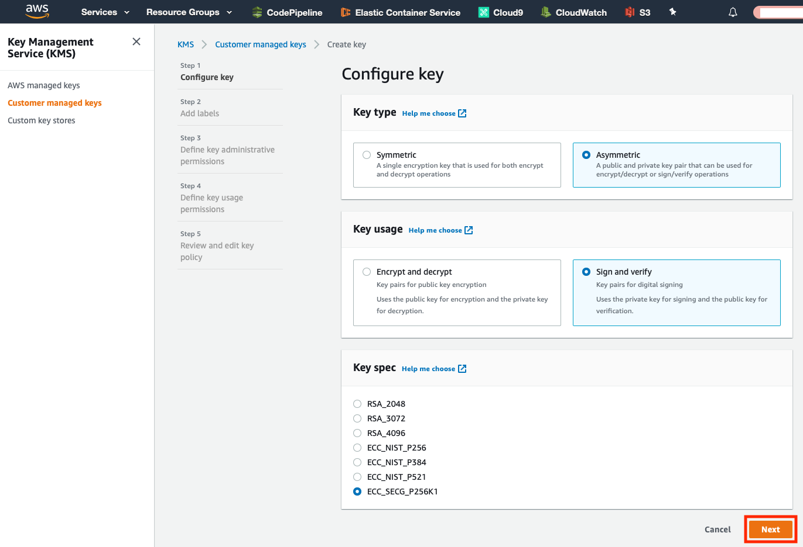

 8. On the next page, input an <em>**Alias**</em> for the key and an optional <em>**Description**</em>, then click the <em>**Next**</em> button:

 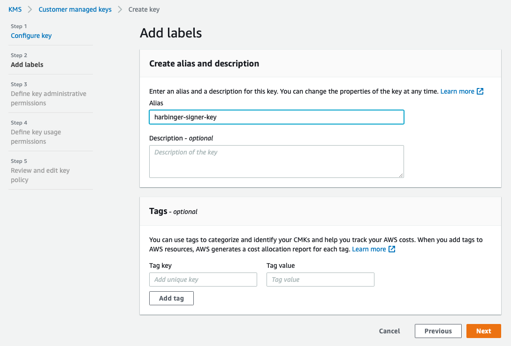

 9. The next page is where you can define key administrators. There is no need to change any settings on this page, unless you would like to give additional IAM users or roles administrative permissions to the key. Click the <em>**Next**</em> button to continue:

 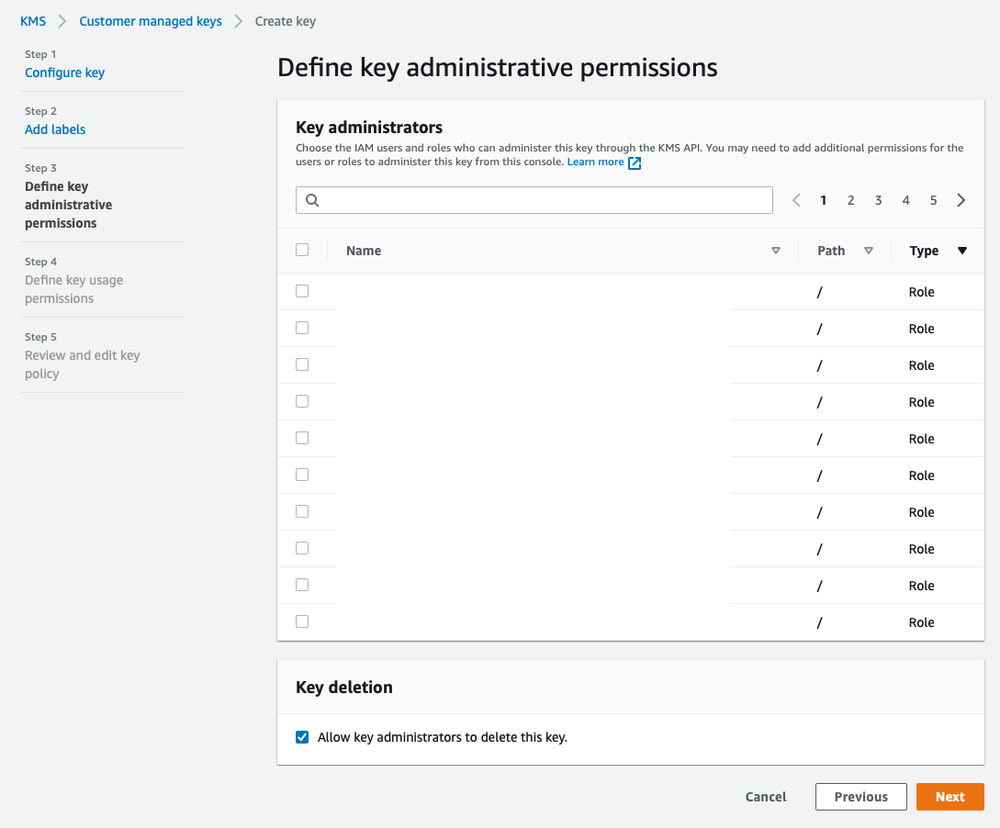

 10. This page is where you can define additional IAM users or roles that have key usage permissions. There is no need to change any settings on this page, unless you would like to give additional IAM users or roles usage permissions for the key. Click the <em>**Next**</em> button to continue:

 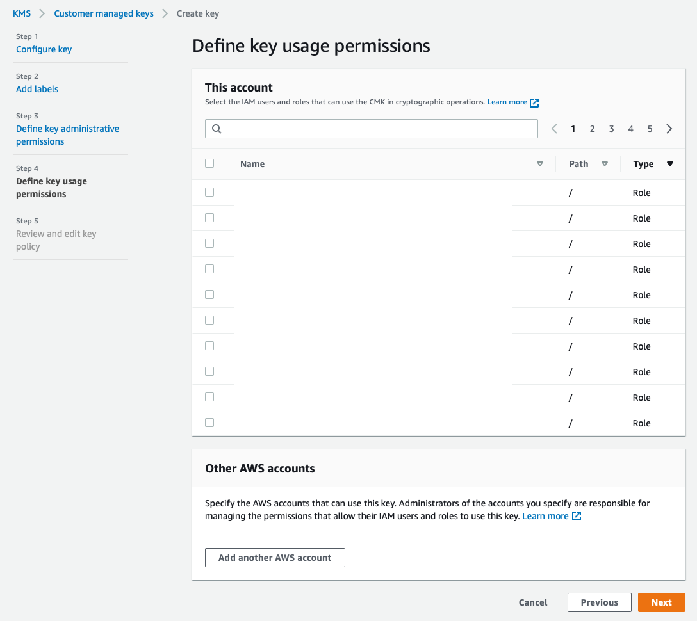

 11. Click <em>**Next**</em> to accept the default key policy, which only grants access to the root user. We'll edit this policy later to give the Serverless application rights to sign with the key.

 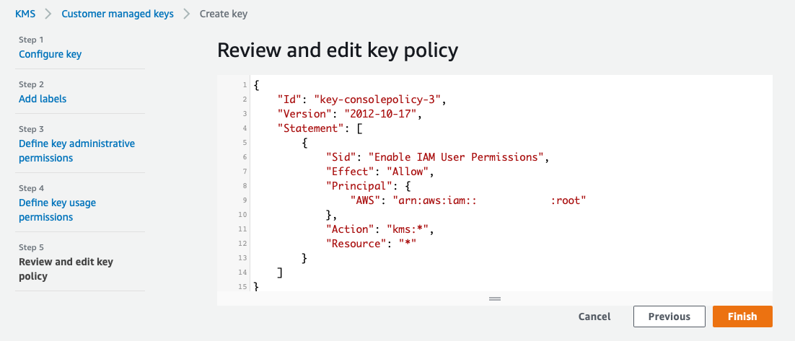

 12. Finally, click <em>**Finish**</em> and you should see a <em>**Success**</em> message similar to the following:

 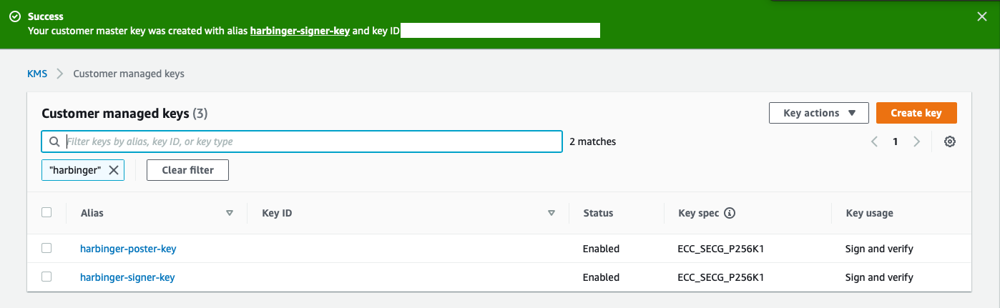

 13. Copy the KMS key ID to your clipboard, or save it somewhere, then, launch <em>**Systems Manager**</em> from the <em>**Services**</em> section of the console (top left):

 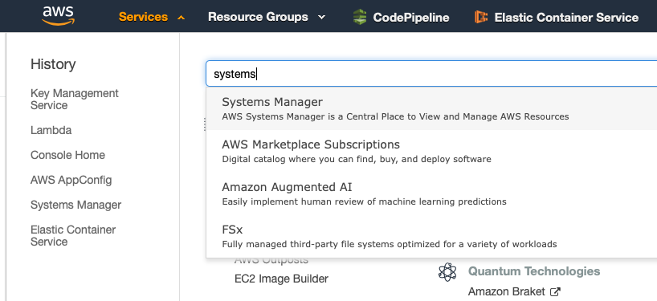

 14. Select <em>**Parameter Store**</em> on the left navigation bar:

 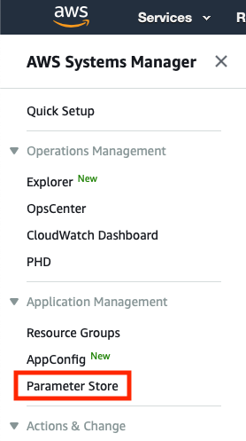

 15. Click the <em>**Create Parameter**</em> button in the top left:

 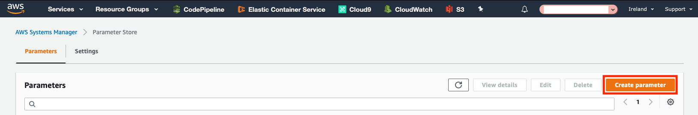

 16. Name the parameter `/tezos/testnet-kms-key-id` or `/tezos/mainnet-kms-key-id` depending on which one you are deploying, and give it an optional description. Leave the other settings at default (Standard tier, String type, Data type text), and paste or enter the KMS key ID you saved in step 13 as the value, without quotes or any surrounding characters, then click the <em>**Create parameter**</em> button:

 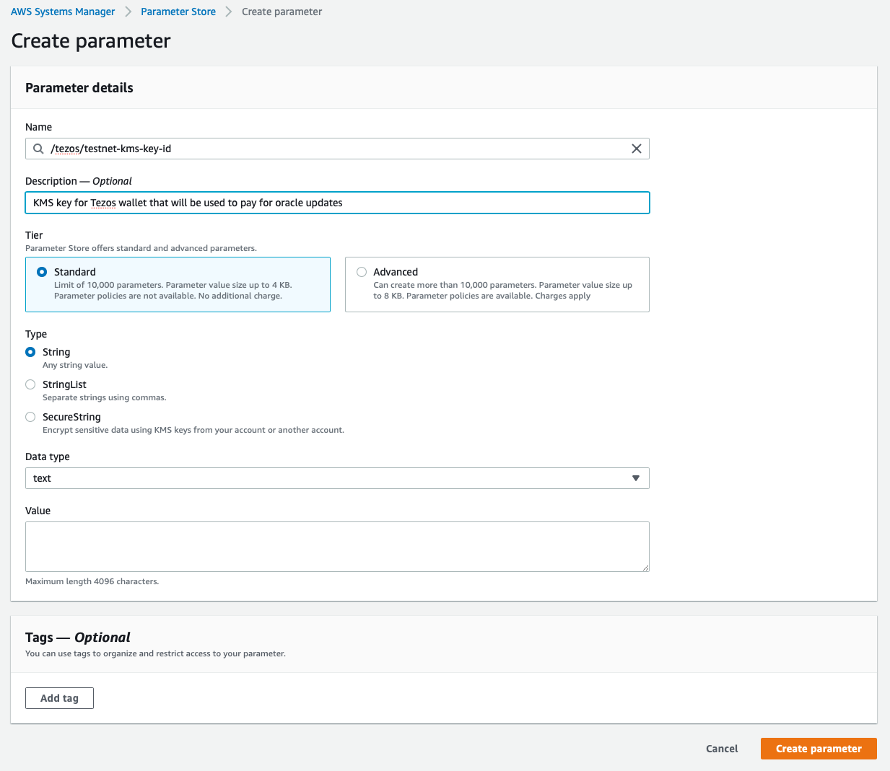

## Coinbase Pro API Key Setup

The following steps are only required if you are planning on using the Coinbase Pro API as a price data provider. Binance doesn't require creating an API key to view their price data. If you are using Binance, please edit the `serverless.yml` file and change lines 67-68 to specify `BINANCE` as your `candleProvider`, then skip to step 25.

 17. Access your [Coinbase Pro API key settings](https://pro.coinbase.com/profile/api) either with the [link](https://pro.coinbase.com/profile/api) or by accessing your profile menu in the top right:

 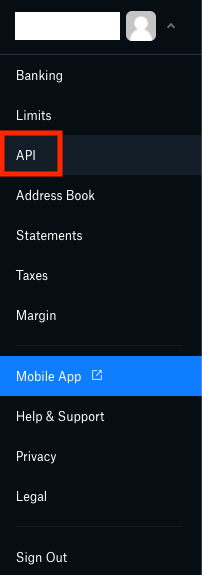

 18. Click the <em>**New API Key**</em> button in the top right:

 

 19. Give the API key a nickname, check the box for <em>**View**</em> permissions only, and either save the passphrase somewhere secure or replace the default random passphrase with a strong passphrase of your choice, then click the <em>**Create API Key**</em> button:

 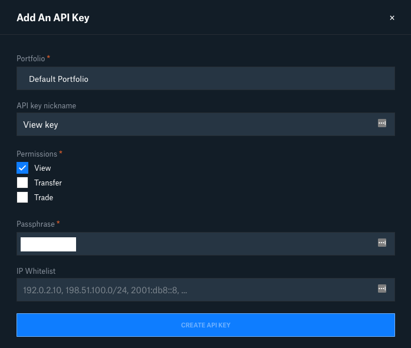

 20. If you have 2-factor authentication enabled, you'll need to go through the 2-step verification, then click the <em>**Add an API Key**</em> button:

 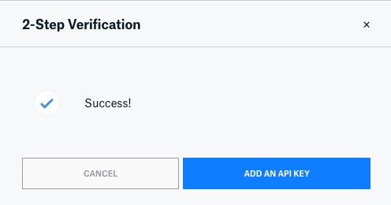

 21. Store the API Secret in a secure place, then click the <em>**Done**</em> button:

 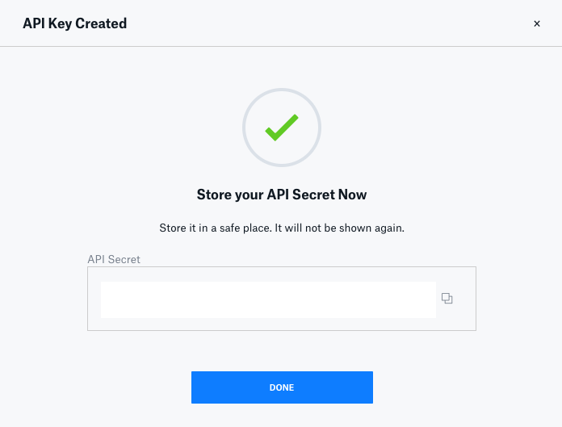

 22. Now you should see the View key that you just created, and you'll need to copy the API key itself and store it somewhere for the next steps. You can click the API key itself to copy it to your clipboard:

 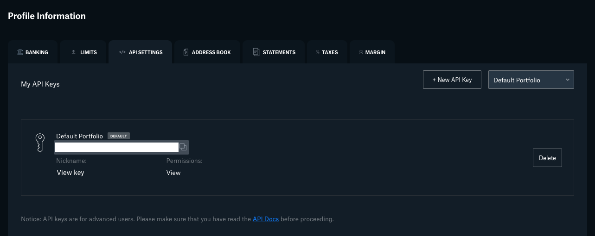 

 23. Create another parameter named `/tezos/testnet-pro-api-key` or `/tezos/mainnet-pro-api-key` depending on which one you are deploying, and give it an optional description. This parameter should be of type `SecureString`, but you can leave the rest of the settings at their defaults, and input your Coinbase Pro API key (with view permissions) as the value, then click the <em>**Create parameter**</em> button:

 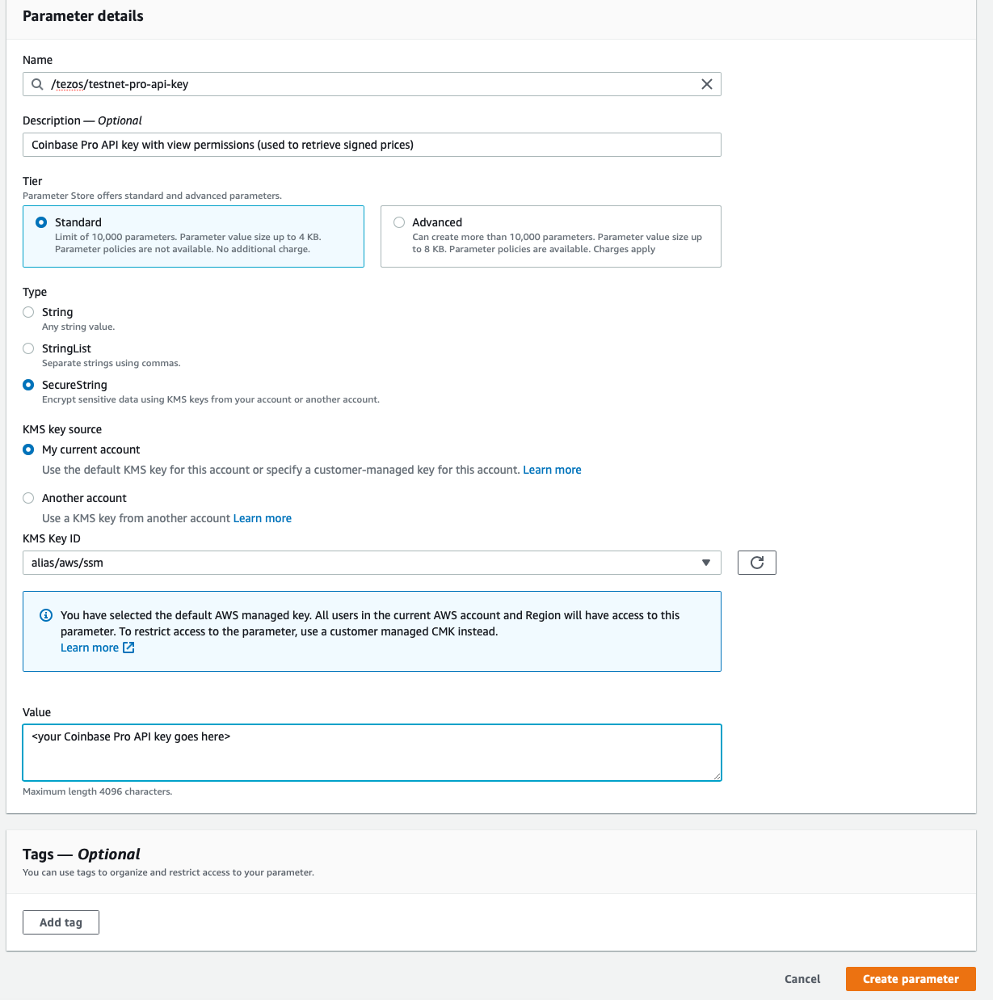

 24. Create two more parameters, one named `/tezos/testnet-pro-api-passphrase` or `/tezos/mainnet-pro-api-passphrase` and the second one named `/tezos/testnet-pro-api-secret` or `/tezos/mainnet-pro-api-secret` with the values that you saved previously in steps 19 and 21. These should both be of type `SecureString` as well.

## Deploying the Serverless Application

 25. Clone this repository to your local system, install all NPM dependencies by typing `npm i` inside the repository directory, then type `sls deploy` to deploy the application. If all goes well, you should see output similar to this. You'll want to save the two endpoints for use later.

 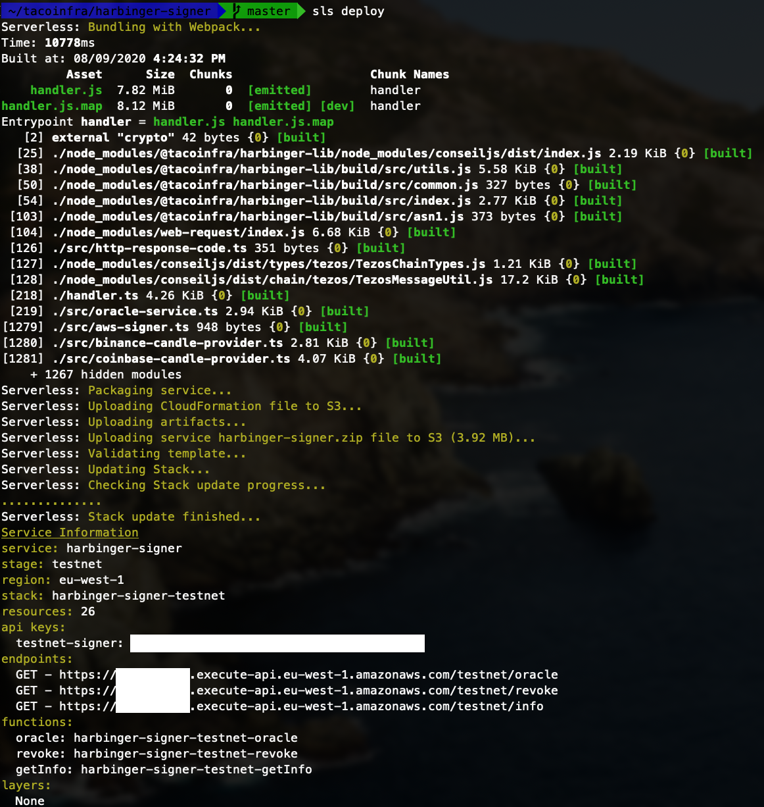

 26. Now, navigate back to <em>**KMS**</em> in the AWS console, and click on the <em>**Customer Managed Key**</em> you created earlier to modify the key policy. Click the button that says <em>**Switch to Policy View**</em>:

 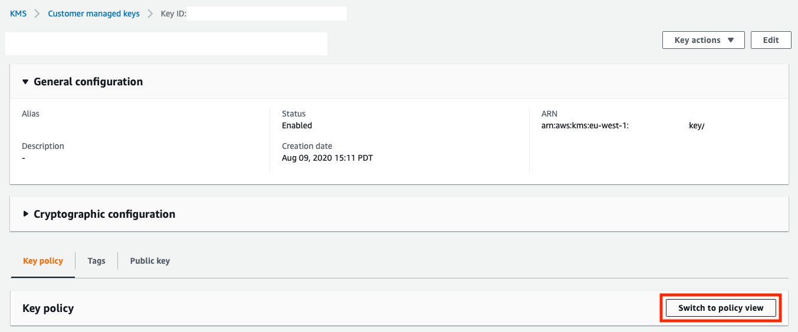

 27. Now, click the button that says <em>**Edit**</em>:

 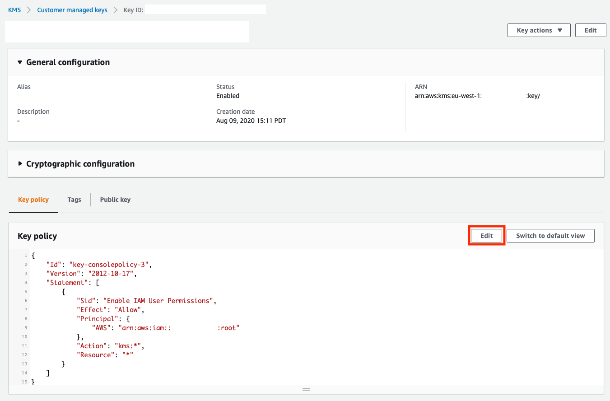

 28. Now we'll need to modify the key policy in order to enable the IAM role that the Serverless application will execute with to use the key for signing operations. You'll need to insert an additional JSON element or section into the <em>**Statement**</em> array. The section you'll need to insert is highlighted in the screenshot below. Don't forget to separate each statement with a comma. Here is the code you'll need to insert:

 ```JSON
		,
        {
            "Sid": "Allow use of the key for digital signing",
            "Effect": "Allow",
            "Principal": {
                "AWS": "arn:aws:iam::{{ AWS Account ID }}:role/harbinger-signer-{{ testnet/mainnet }}-{{ AWS Region }}-lambdaRole"
            },
            "Action": [
                "kms:Sign",
                "kms:Verify",
                "kms:GetPublicKey"
            ],
            "Resource": "*"
        }
 ```

 **Important Note:** You must replace the 3 sections of the JSON in each statement that have `{{ }}` (double curly braces) surrounding them with the appropriate information. This string should also have no spaces in it.
  * **AWS Account ID** - This is your 12-digit numeric AWS account ID
  * **Testnet/Mainnet** - This is the string `testnet` or `mainnet` (all lower case) depending on what you are deploying
  * **Region** - This is the AWS region you are deploying to, such as `eu-west-1`

 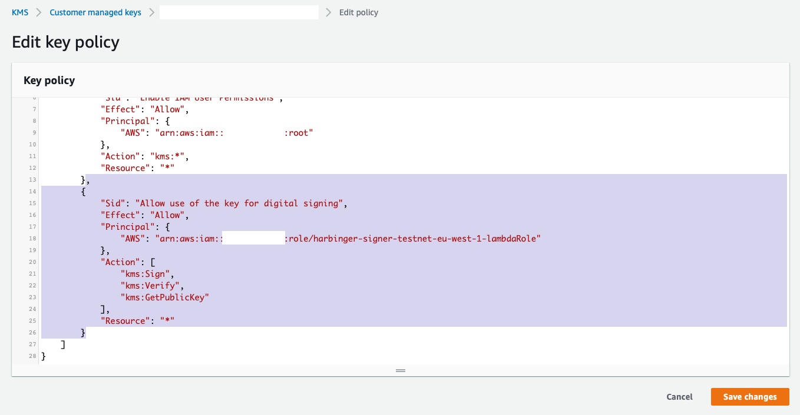

## Determining the Tezos address of the KMS key used to generate signatures

Congratulations, you've just deployed a Serverless application that will automatically sign Coinbase Pro or Binance prices for the markets/order books you choose. Here is how to determine the Tezos public key (`sppk...`) for the private key that is used to sign the prices:

 1. Curl the `info` endpoint that is displayed when you ran the last step (`sls deploy`) and it should output the `sppk...` address. You will need to include an `x-api-key` header that is set to the API key that was output by the previous `sls deploy` command. Here is the full command:
 ```
 curl --silent -H 'x-api-key: {{ your API key }}' https://{{ your API gateway }}.execute-api.eu-west-1.amazonaws.com/testnet/info
 ```

 If you get a `{"message": "Internal server error"}` instead, you should check your Lambda logs inside the AWS console to see what went wrong. Most likely you have either not created all of the Systems Manager parameters correctly or the KMS key policy is not 100% correct. You should see output like this:

 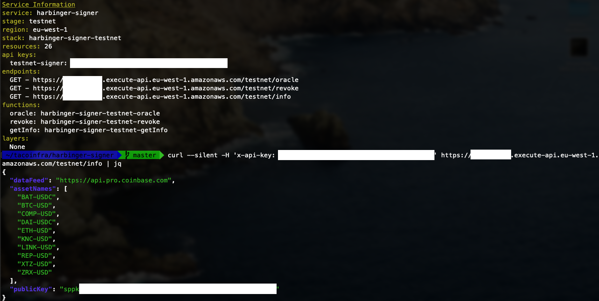

## Customizing Functionality

[`OracleService`](https://github.com/tacoinfra/harbinger-signer/blob/master/src/oracle-service.ts) is a pluggable service that can handle all serverless requests for the signer. It is initialized with an object conforming to the [`Signer`](https://github.com/tacoinfra/harbinger-signer/blob/master/src/signer.ts) interface, an object conforming to the [`CandleProvider`](https://github.com/tacoinfra/harbinger-signer/blob/master/src/candle-provider.ts) interface and a list of assets to sign.

End users can customize this library with custom signers and candle providers.

### Custom Assets

An assets list is configured in [`serverless.yml`](https://github.com/tacoinfra/harbinger-signer/blob/master/serverless.yml#L60). This list can be customized to any set of assets.

### Custom Candle Providers

An object conforming to the [`CandleProvider`](https://github.com/tacoinfra/harbinger-signer/blob/master/src/candle-provider.ts) interface can retrieve `Candle` objects from an external feed. [`Candle Provider`s are injected into the `OracleService` via constructor](https://github.com/tacoinfra/harbinger-signer/blob/dfd677ec8724b03483e65ac156a2213e22d771a0/handler.ts#L89).

`Harbinger-Signer` has several `CandleProvider`s built in:
- [`BinanceCandleProvider`](https://github.com/tacoinfra/harbinger-signer/blob/master/src/binance-candle-provider.ts): Provides candles from the Binance API.
- [`CoinbaseCandleProvider`](https://github.com/tacoinfra/harbinger-signer/blob/master/src/coinbase-candle-provider.ts): Provides candles from the Coinbase Pro API.
- [`GeminiCandleProvider`](https://github.com/tacoinfra/harbinger-signer/blob/master/src/gemini-candle-provider.ts): Provides candles from the Gemini API.
- [`OkexCandleProvider](https://github.com/tacoinfra/harbinger-signer/blob/master/src/okex-candle-provider.ts): Provides candles from the OKEx API.

### Custom Signers

An object conforming to the [`Signer`](https://github.com/tacoinfra/harbinger-signer/blob/master/src/signer.ts) interface can sign bytes and provide a public key. [`Signer`s are injected into `OracleService` via constructor](https://github.com/tacoinfra/harbinger-signer/blob/dfd677ec8724b03483e65ac156a2213e22d771a0/handler.ts#L89). 

`Harbinger-Signer` has one signer built in, [`AwsSigner`](https://github.com/tacoinfra/harbinger-signer/blob/master/src/aws-signer.ts) which wraps calls to an [AWS KMS Service](https://aws.amazon.com/kms/).

## Credits

Harbinger is written and maintained by [Luke Youngblood](https://github.com/lyoungblood) and [Keefer Taylor](https://github.com/keefertaylor). 
